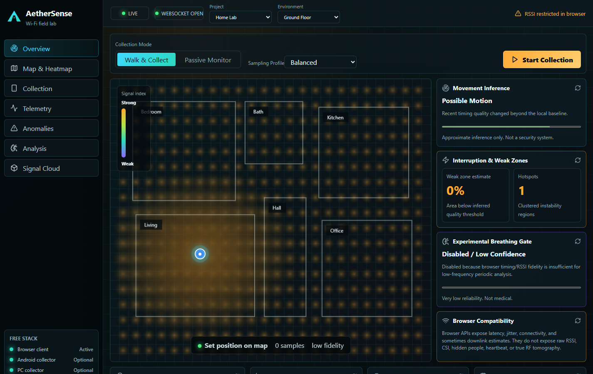

# AetherSense

**A zero-cost Wi-Fi environmental intelligence lab for your home.**

AetherSense turns a normal home Wi-Fi connection, an Android phone browser, and an optional low-end PC into a futuristic signal-mapping web app. It visualizes real network timing behavior, helps map weak/interference zones, supports editable multi-floor house plans, and estimates disturbance patterns without pretending to do impossible Wi-Fi magic.



## The Honest Promise

AetherSense is built to look sci-fi, but stay technically honest.

It does **not** claim:

- CSI sensing
- Wi-Fi X-ray vision
- hidden-human imaging
- medical vitals
- accurate heartbeat or BPM
- exact obstacle detection
- guaranteed door/window detection
- exact room reconstruction
- fake hardcoded live sensing

It does use real, free, browser-accessible signals:

- backend ping latency
- jitter and timing fluctuation
- connectivity interruptions
- browser Network Information API when available
- optional local RSSI collectors when the device/OS actually exposes RSSI

## What It Can Do

- Live Wi-Fi/network timing dashboard
- Android-friendly walk-and-sample collection mode
- Editable house map with up to 4 floors
- Custom rooms, names, walls, doors, windows, dimensions, router position, and router height
- Floor-by-floor heatmaps
- Weak, strong, dead, unstable, and fluctuation zones
- Approximate movement/disturbance inference
- Approximate door/window changed/open/closed hints from nearby signal changes
- Manual door/window overrides
- Pseudo-3D signal cloud with WebGL fallback for weak machines
- Experimental breathing gate that disables itself when fidelity is insufficient
- Free deployment path with Render manual services

## Stack

- Frontend: React, Vite, TypeScript, Three.js, CSS
- Backend: FastAPI, WebSockets, NumPy, SciPy, scikit-learn
- Storage: local JSONL session files
- Optional collectors: Python PC collector, Android Kotlin skeleton
- Cost: free
- Hardware required: none beyond your existing router/phone/PC

## Local Setup

Backend:

```bash
cd backend
python -m venv .venv
.venv\Scripts\activate
pip install -r requirements.txt
uvicorn app.main:app --reload --host 0.0.0.0 --port 8000
```

Frontend:

```bash
npm install
npm run dev
```

Open:

```text
http://localhost:5173
```

For Android walk mode, keep the phone on the same Wi-Fi and open:

```text
http://YOUR_PC_LAN_IP:5173
```

## Render Deployment Without Blueprint

Do **not** use Render Blueprint if it asks for payment details. Use normal manual services instead.

### 1. Backend

Render -> **New > Web Service**

- Repo: `adernall/aethersense`
- Name: `aethersense-api`
- Runtime: `Python 3`
- Root Directory: `backend`
- Build Command: `pip install -r requirements.txt`
- Start Command: `uvicorn app.main:app --host 0.0.0.0 --port $PORT`
- Health Check Path: `/api/health`
- Instance Type: `Free`
- Environment Variable: `PYTHON_VERSION=3.12.0`

After deploy, test:

```text
https://YOUR-AETHERSENSE-API.onrender.com/api/health
```

Expected:

```json
{"status":"ok","stack":"fastapi-free-open-source"}
```

### 2. Frontend

Render -> **New > Static Site**

- Repo: `adernall/aethersense`
- Name: `aethersense`
- Root Directory: leave blank
- Build Command: `npm ci && npm run build`
- Publish Directory: `dist`
- Instance Type: `Free`
- Rewrite Rule: `/*` -> `/index.html`

Environment variables:

```text
VITE_API_BASE=https://YOUR-AETHERSENSE-API.onrender.com
VITE_WS_BASE=https://YOUR-AETHERSENSE-API.onrender.com
```

The frontend converts the `https://` WebSocket base to `wss://` automatically.

## Optional RSSI Collectors

Browsers usually hide RSSI and SSID for privacy. That is normal.

Optional local collectors are included only when you want better fidelity:

- `collectors/pc_wifi_collector.py`: uses OS Wi-Fi commands where available
- `collectors/android-kotlin/`: native Android RSSI skeleton requiring user permission

If RSSI is unavailable, collectors stop clearly instead of inventing values.

## Project Map

```text
backend/       FastAPI, WebSockets, analysis, session storage
src/           React app, heatmap, house editor, telemetry client
collectors/    Optional local RSSI collectors
docs/          API, deployment, architecture, compatibility, troubleshooting
```

## License

MIT. Build on it, self-host it, remix it, and keep it honest.
