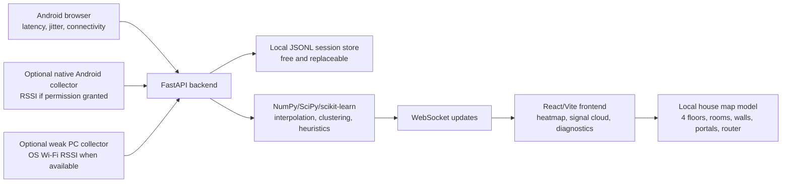

# Architecture

## Data Flow

1. The browser repeatedly calls `/api/ping`.
2. The client computes latency, jitter, downlink hints, interruptions, and a quality index.
3. During walk mode, the user taps/updates their location on the room map.
4. The sample includes the active floor ID.
5. Each real sample is posted to `/api/samples`.
6. The backend interpolates a floor-level heatmap and identifies weak/unstable regions.
7. Doors and windows are estimated only from nearby shifts against a local baseline, or set by manual override.
8. Movement and occupancy are inferred only from statistical disturbance patterns and labeled approximate.
9. Breathing analysis is disabled unless a stable, high-fidelity RSSI stream exists.

## Deployment Shape

Free deployment can be split:

- Frontend: GitHub Pages, Netlify free, Vercel hobby, Cloudflare Pages.
- Backend: Render free, Fly.io free allowance, Railway free where available, Oracle Free Tier VM.
- Database: none required. JSONL local persistence is used by default.

For long-term data, replace `SessionStore` with SQLite or Postgres. Keep it free.
